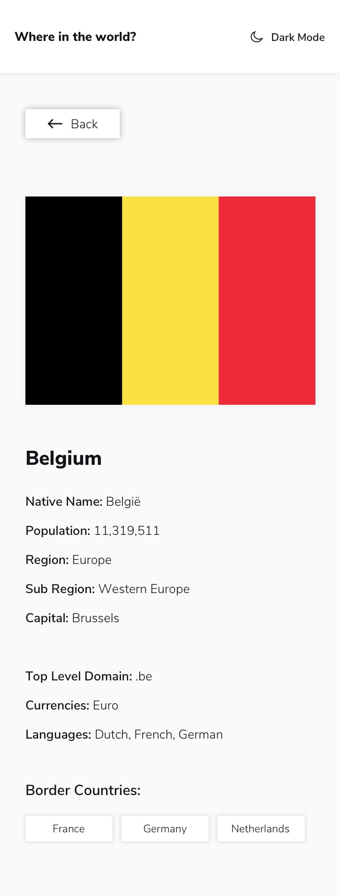

# 🌍 Where in the World? — REST Countries API App

This is a solution to the [REST Countries API with color theme switcher challenge on Frontend Mentor](https://www.frontendmentor.io/challenges/rest-countries-api-with-color-theme-switcher-5cacc469fec04111f7b848ca). It helped me improve my skills in **React**, **dark/light theme implementation**, and **working with REST APIs** to build a dynamic UI.

---

## 📋 Table of Contents

- [Overview](#overview)  
  - [Features](#features)  
  - [Screenshots](#screenshots)  
  - [Live Links](#live-links)  
  - [Built With](#built-with)
  - [Backend Features](#backend-features)
- [Author](#author)

---

## Overview

This application displays country data fetched from the REST Countries API. Users can view details about each country, search by name, filter by region, switch themes, and navigate to bordering countries.

---

### Features

- View all countries from the API on the homepage  
- Search for a country using a text input  
- Filter countries by region  
- Click on a country to view more detailed information  
- Navigate to border countries via links  
- Toggle between light and dark themes  
- Responsive design for mobile, tablet, and desktop  
- Graceful handling of missing or undefined data

---

### Screenshots

  

  

---

### Live Links

- 📁 GitHub Repository: [REST Countries App](https://github.com/vedantagrawal524/rest-countries-api)  
- 🌐 Live Site: [https://where-in-the-world-countries.vercel.app/](https://where-in-the-world-countries.vercel.app/)

---

### Built With

- HTML5
- TailWind CSS
- JavaScript
- React  
- React Router  
- REST Countries API  
- Mobile-first responsive layout  
- Dark/Light Theme Toggle  
- [Vercel](https://vercel.com/) for deployment
- Node.js
- Express.js
- MongoDB
- Mongoose
- [Render](https://render.com/) for Server deployment  

---

### Backend Features

- Created an **Express.js server** to handle Countries Data.
- Countries Data are stored securely in a **MongoDB database**.
- Used **Mongoose** to define the Countries Data schema and perform validations.
- Hosted backend using **Render**.

---

## Author

- Portfolio – _Vedant Agrawal_  
- Frontend Mentor – [@vedantagrawal524](https://www.frontendmentor.io/profile/vedantagrawal524)  
- GitHub – [@vedantagrawal524](https://github.com/vedantagrawal524)

---

🧠 _Fueled by curiosity, completed with precision. Feedback and contributions are always welcome!_
